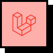
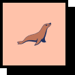
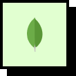
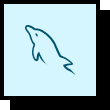
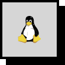
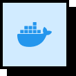

 

    <h3>Seja bem-vido ao meu perfil! Eu sou Vinicius.</h3> 
    

    💻 Programador back-end sem front.   
    ☕ Viciado em café, mas com problemas cardíacos.   
    🤘 Heavy metal no fone, PHP no monitor.  🐘

    
    
       

##

### Tecnologias

####  ✒️ Front-end

#### ⚙️ Back-end

#### 💾 Databases

#### 🌐 Servidores

 

<picture>
  <source media="(prefers-color-scheme: dark)" srcset="https://raw.githubusercontent.com/ViniciusCanedo/ViniciusCanedo/output/github-contribution-grid-snake-dark.svg">
  <source media="(prefers-color-scheme: light)" srcset="https://raw.githubusercontent.com/ViniciusCanedo/ViniciusCanedo/output/github-contribution-grid-snake.svg">
  
</picture>
